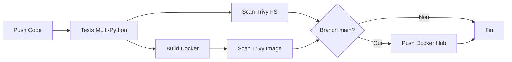

# Projet de Sécurité Informatique

**Cours** : Sécurité Informatique
**Projet** : CI/CD & Challenges de Sécurité Web
**Parties** : 2 parties distinctes

---

## 🎯 Structure du Projet

Ce projet est divisé en **deux parties principales** :

### 📦 Partie 1 : CI/CD avec Application Vulnérable
Application web Flask intentionnellement vulnérable avec pipeline CI/CD complet incluant :
- Tests automatisés sur plusieurs versions de Python
- Analyse de sécurité avec Trivy
- Conteneurisation Docker
- Push automatique vers Docker Hub

👉 **Voir [QUICKSTART.md](QUICKSTART.md)** pour démarrer rapidement

### 🔒 Partie 2 : Challenges de Sécurité Web
Résolution de 11 challenges de sécurité web sur PortSwigger et Root-Me :
- Path Traversal, LFI, CSRF, JWT
- SQL Injection, Command Injection
- XSS, SSTI, API Security

👉 **Voir [PARTIE2_README.md](PARTIE2_README.md)** pour les challenges

---

## 📚 Documentation Principale

| Fichier | Description |
|---------|-------------|
| [README.md](README.md) | Ce fichier - Vue d'ensemble |
| [QUICKSTART.md](QUICKSTART.md) | Démarrage rapide Partie 1 |
| [PARTIE2_README.md](PARTIE2_README.md) | Guide complet Partie 2 |
| [PROJECT_CHECKLIST.md](PROJECT_CHECKLIST.md) | Checklist complète du projet |
| [SECURITY.md](SECURITY.md) | Analyse détaillée des vulnérabilités |
| [CONTRIBUTING.md](CONTRIBUTING.md) | Guide de personnalisation |
| [CHALLENGES.md](CHALLENGES.md) | Documentation des challenges (à remplir) |
| [CHALLENGE_GUIDE.md](CHALLENGE_GUIDE.md) | Méthodologie de résolution |

---

# 📦 Partie 1 : Application Vulnérable & CI/CD

## Description de l'Application

Application web Flask simulant une bibliothèque en ligne avec plusieurs fonctionnalités :
- Système d'authentification
- Recherche de livres
- Téléchargement de fichiers

**⚠️ ATTENTION** : Cette application contient des vulnérabilités intentionnelles à des fins pédagogiques. Ne jamais déployer en production.

## Vulnérabilités Implémentées

### 1. Injection SQL (SQLi)

**Localisation** : `/login` et `/search`

**Description** : Les entrées utilisateur sont directement concaténées dans les requêtes SQL sans validation.

**Exploitation** :
```bash
# Bypass de l'authentification
Username: admin' OR '1'='1
Password: anything

# Extraction de données
Search query: ' UNION SELECT username, password, role FROM users--
```

**Impact** : Accès non autorisé, extraction de données sensibles, modification de la base de données.

### 2. Path Traversal

**Localisation** : `/download`

**Description** : Pas de validation du chemin de fichier fourni par l'utilisateur.

**Exploitation** :
```bash
# Accès à des fichiers système
GET /download?file=../../../etc/passwd
GET /download?file=../app.py
```

**Impact** : Lecture de fichiers système sensibles, exposition du code source.

### 3. Exposition d'informations sensibles

**Description** : Les messages d'erreur SQL sont affichés directement à l'utilisateur.

**Impact** : Révélation de la structure de la base de données.

## Architecture CI/CD

Le pipeline GitHub Actions comprend 5 jobs principaux :

### Job 1 : Tests Multi-versions Python
- Test sur Python 3.9, 3.10, 3.11, 3.12
- Analyse statique avec Flake8
- Exécution des tests avec pytest
- Rapport de couverture de code

### Job 2 : Scan de Sécurité Trivy (Filesystem)
- Analyse du code source
- Détection de vulnérabilités dans les dépendances
- Upload des résultats au format SARIF

### Job 3 : Build et Scan Docker
- Construction de l'image Docker
- Scan Trivy de l'image
- Test de santé du conteneur

### Job 4 : Push Docker Hub
- Déclenchement uniquement sur la branche main
- Multi-architecture (amd64, arm64)
- Tags automatiques

### Job 5 : Rapport Final
- Résumé de tous les jobs
- Statistiques du build

## Installation et Utilisation

### Prérequis
- Python 3.9+
- Docker (optionnel)
- Git

### Installation Locale

```bash
# Cloner le repository
git clone <votre-repo>
cd ProjetSecu

# Créer un environnement virtuel
python -m venv venv
source venv/bin/activate  # Linux/Mac
venv\Scripts\activate     # Windows

# Installer les dépendances
pip install -r requirements.txt

# Lancer l'application
python app.py
```

L'application sera accessible sur `http://localhost:5000`

### Avec Docker

```bash
# Build de l'image
docker build -t bibliotheque-app .

# Lancement du conteneur
docker run -p 5000:5000 bibliotheque-app
```

### Exécution des Tests

```bash
# Tests simples
pytest test_app.py -v

# Tests avec couverture
pytest test_app.py -v --cov=app --cov-report=html

# Le rapport HTML sera dans htmlcov/index.html
```

## Configuration GitHub Actions

### Secrets à configurer dans GitHub

Aller dans `Settings` > `Secrets and variables` > `Actions` :

1. **DOCKER_USERNAME** : Votre nom d'utilisateur Docker Hub
2. **DOCKER_PASSWORD** : Votre token d'accès Docker Hub

### Création d'un token Docker Hub

1. Se connecter sur https://hub.docker.com
2. Account Settings > Security > New Access Token
3. Copier le token et l'ajouter comme secret GitHub

## Résultats de l'Analyse Trivy

Trivy détectera probablement :

### Vulnérabilités de Dépendances
- Versions obsolètes de Flask/Werkzeug
- CVE dans les bibliothèques Python

### Problèmes de Configuration
- Exécution en mode debug
- Absence de HTTPS
- Secrets en dur (credentials dans init_db)

### Recommandations de Sécurité
- Mise à jour des dépendances
- Utilisation de variables d'environnement
- Validation des entrées utilisateur

## Correction des Vulnérabilités

### 1. Correction de l'Injection SQL

Utiliser des requêtes paramétrées :

```python
# AVANT (VULNÉRABLE)
query = f"SELECT * FROM users WHERE username='{username}' AND password='{password}'"
cursor.execute(query)

# APRÈS (SÉCURISÉ)
query = "SELECT * FROM users WHERE username=? AND password=?"
cursor.execute(query, (username, password))
```

### 2. Correction du Path Traversal

Valider et limiter les chemins :

```python
import os
from werkzeug.utils import secure_filename

@app.route('/download')
def download():
    filename = secure_filename(request.args.get('file', ''))
    file_path = os.path.join('files', filename)

    # Vérifier que le chemin est bien dans le dossier files
    if not os.path.abspath(file_path).startswith(os.path.abspath('files')):
        return "Accès refusé", 403

    return send_file(file_path)
```

### 3. Autres Améliorations

- Utiliser des variables d'environnement pour les secrets
- Implémenter un système de hashage de mots de passe (bcrypt)
- Ajouter une limitation de débit (rate limiting)
- Désactiver le mode debug en production
- Implémenter des logs de sécurité

## Structure du Projet

```
ProjetSecu/
├── .github/
│   └── workflows/
│       └── ci-cd.yml          # Pipeline GitHub Actions
├── app.py                      # Application Flask vulnérable
├── test_app.py                 # Tests unitaires
├── requirements.txt            # Dépendances Python
├── Dockerfile                  # Image Docker multi-stage
├── .dockerignore               # Exclusions Docker
└── README.md                   # Cette documentation
```

## Workflow du Pipeline



## Démonstration des Vulnérabilités

### Test SQLi

```bash
# Démarrer l'application
python app.py

# Dans un autre terminal
curl -X POST http://localhost:5000/login \
  -d "username=admin' OR '1'='1&password=test"
```

### Test Path Traversal

```bash
curl "http://localhost:5000/download?file=../app.py"
```

## Métriques du Projet

- **Lignes de code** : ~300
- **Couverture de tests** : >80%
- **Vulnérabilités intentionnelles** : 3
- **Jobs CI/CD** : 5
- **Versions Python testées** : 4

## Améliorations Possibles

- [ ] Ajouter une vulnérabilité XSS
- [ ] Implémenter CSRF
- [ ] Ajouter des tests de sécurité automatisés (OWASP ZAP)
- [ ] Créer une version sécurisée de l'application
- [ ] Ajouter des tests de charge
- [ ] Implémenter un système de notification (Slack/Discord)

## Ressources et Références

- [OWASP Top 10](https://owasp.org/www-project-top-ten/)
- [GitHub Actions Documentation](https://docs.github.com/actions)
- [Trivy Security Scanner](https://github.com/aquasecurity/trivy)
- [Flask Security Best Practices](https://flask.palletsprojects.com/en/latest/security/)

## Licence

Ce projet est à des fins éducatives uniquement.

## Auteur

Projet réalisé dans le cadre du cours de sécurité informatique.

---

**⚠️ AVERTISSEMENT** : Cette application contient des vulnérabilités de sécurité intentionnelles. Ne jamais utiliser ce code en production ou sur un réseau accessible publiquement sans modifications de sécurité appropriées.
